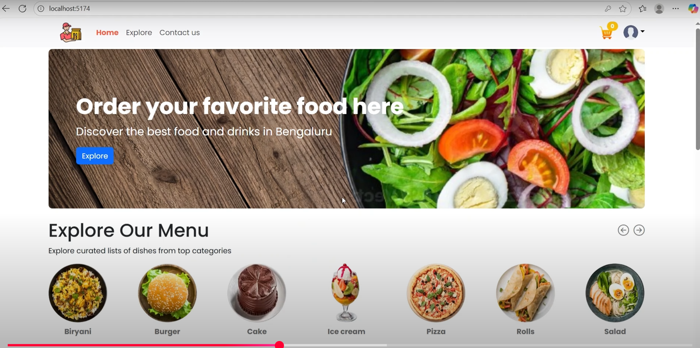
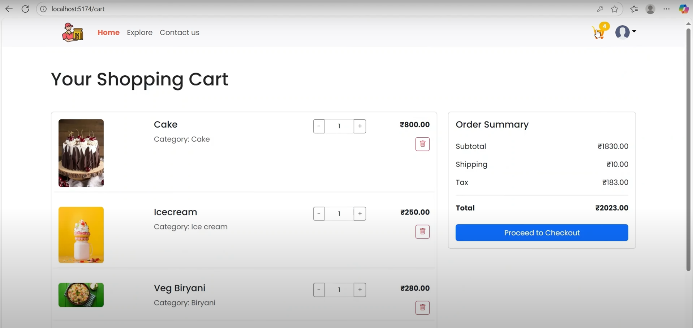
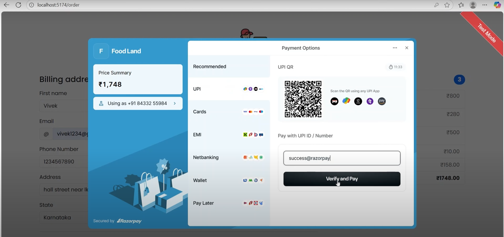
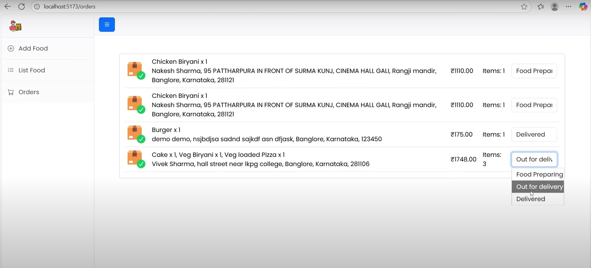
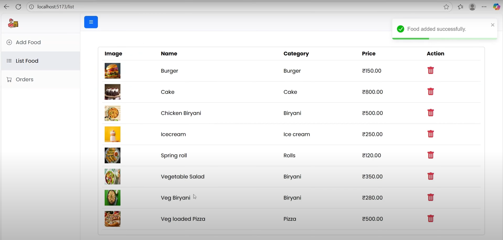
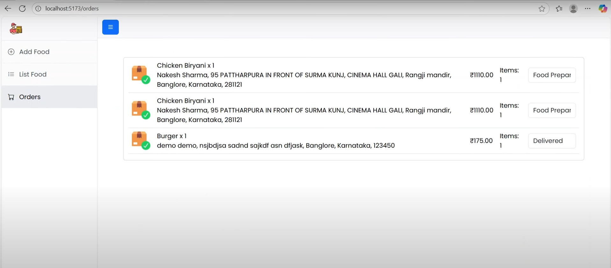

# 🍔🔥 Online Food Delivery App | Java Fullstack Project 🚀

🎥 **Live Demo Video:**   
  
👉 [Watch the Full Sizzle on YouTube](https://youtu.be/GJm99130qzo)

---

## 🌟 Overview

Craving convenience? 🍕🍔 This Online Food Delivery App delivers your favorite eats straight to your doorstep! Built with a powerful Java Spring Boot backend, React’s magic on the user interface, and MongoDB keeping all data fresh and tasty, it offers a mouth-watering combo of speed, security (thanks to JWT), and real-time updates with WebSockets. Perfect for hungry users and savvy food admins alike! 🍽️🚀

---

## 🚀 Features that’ll make you hungry for more!

- 🏠 **Home Sweet Home:** Browse categories and discover deliciousness instantly!
- 🛒 **Cart Control:** Add, adjust, and review your feast before checkout.
- 💳 **Payment Party:** Pay your way—UPI, cards, wallets, or pay later!
- ⚡ **Live Status:** Watch your order race to your table with real-time updates.
- 🔐 **Locked Down:** Secure login for foodies and admins using JWT & Spring Security.
- 🛠️ **Admin Superpowers:** Manage the menu, track orders, and conquer the kitchen chaos.
- 📱 **Fully Responsive:** A smooth experience on all your devices, from phones to desktops.

---

## 🍽️ Snapshots of Yummy Goodness

### 🏠 Home Page
  
Start your culinary journey with a vibrant menu and tasty category icons!

### 🛒 Shopping Cart
  
Review your treats, tweak quantities, and get ready to feast.

### 💳 Checkout
  
Quick & secure checkout with multiple payment options — get your food fast!

### 🍳 Admin Orders After Checkout
  
Admins track order status live — kitchen hustle made easy!

### 👩‍💼 Admin Dashboard
  
Command center to manage your menu and orders like a boss!

### 📋 Food Listings (Admin)
  
Keep the menu fresh and fabulous with full control over food items.

---

## 🔧 Technologies & Tools in the Kitchen

| Ingredient       | Role                                    |
|------------------|-----------------------------------------|
| ☕ Java          | The main course — backend magic          |
| 🌱 Spring Boot  | Recipe for REST APIs & security          |
| 🍃 MongoDB      | Fresh, scalable database goodness        |
| ⚛️ React         | Delightful user interface                 |
| 🔐 JWT           | Your security guard                      |
| ⚡ WebSockets     | Real-time kitchen updates                  |
| 🎨 HTML, CSS     | Styling to make everything look delicious |

---

## 🏅 Achievements & Learning Bites

- Crafted APIs and UI that blend seamlessly like a gourmet meal
- Secured user roles with JWT-based authentication, separating foodies and kitchen staff
- Integrated real-time tracking so you're always in the loop
- Created a payment gateway feast with multiple tasty options
- Designed a slick responsive UI for all appetites and devices

---

## 💌 Author & Food Ally

**Harshita Dutta**  
📧: [harshitadutta1272@gmail.com](mailto:harshitadutta1272@gmail.com)  
🐙 GitHub: [harshita-d12](https://github.com/harshita-d12)  
🔗 LinkedIn: [harshita-dutta](https://linkedin.com/in/harshita-dutta)

---

🍴 Hungry for more? Dive in and savor the code behind this savory project!
